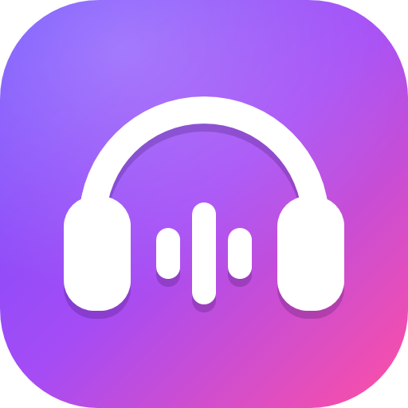

  

<h1 align="center">Ultimate MP3 Player</h1>

  <b>La tua musica, offline e senza pubblicità.</b> 
  Incolla un link da YouTube Music, Spotify, SoundCloud, YouTube, TikTok, Instagram, Deezer, Bandcamp o centinaia di
  altri siti: i brani finiscono nella tua libreria con copertina e tag, pronti da ascoltare.

  
  
  
  

  

<a href="README.md">English</a> · <b>Italiano</b>

---

## ✨ In breve

<table>
<tr>
<td width="50%" valign="top">

### 🔗 Incolli un link, hai la musica
Brani, album e playlist intere, salvati nello stesso ordine in una tua playlist, anche con il video se lo vuoi.
I brani che hai già non vengono mai riscaricati.

</td>
<td width="50%" valign="top">

### 🎧 Un lettore come Spotify
Forma d'onda per spostarsi nel brano, casuale vero, dissolvenza, volume normalizzato, equalizzatore a 10 bande,
tasti multimediali e controlli di Windows.

</td>
</tr>
<tr>
<td valign="top">

### ♾️ Una coda che si riempie da sola
Avvii un brano e i successivi della sua playlist si mettono in fila da soli (fino a 50), rimpiazzati a ogni brano.
Oppure la spegni e ascolti un brano alla volta.

</td>
<td valign="top">

### 🎛️ Modalità DJ
Due tracce con forme d'onda scorrevoli, BPM rilevati, sync, key lock, EQ a 3 bande con kill e crossfader.
Registra il mix direttamente nella libreria.

</td>
</tr>
<tr>
<td valign="top">

### 🏷️ Playlist, preferiti e tag
Tag colorati come i ruoli di Discord, filtri, una pagina per ogni tag, modifiche di massa e menu col tasto destro
ovunque.

</td>
<td valign="top">

### 👥 Profili e temi
Un profilo per persona con playlist, cronologia, equalizzatore e tema suoi; i brani sono condivisi. Italiano e
inglese, copertina 3D e stato su Discord.

</td>
</tr>
<tr>
<td colspan="2" valign="top">

### 🎉 Ascolta insieme
Stanze sulla tua rete (o tramite Radmin VPN): tutti sentono lo stesso brano nello stesso momento, con la chat, una
coda condivisa e i permessi decisi dall'host. Ogni computer scarica i brani dal loro link, oppure glieli manda
qualcuno nella stanza.

</td>
</tr>
</table>

## 🆕 Novità della 3.0.0

- **Ascolta insieme**: crea una stanza o entra in una trovata sulla rete; riproduzione sincronizzata, chat, coda
  condivisa, l'host decide chi può aggiungere, togliere, saltare, mettere in pausa o andare avanti e indietro (e può
  espellere). Se l'host esce, la stanza passa a un altro. I brani che ti piacciono li salvi nella libreria con un clic.
- **DJ**: un nuovo selettore dei brani (copertine, BPM, playlist e tag, selezione chiara) e il **TAP** su entrambe le
  tracce
- **Scorrimento fluido** rifatto come quello di Firefox: una sola scivolata continua, in tutte le liste, i menu e le
  finestre
- **Discord**: le copertine che non comparivano (immagini enormi di SoundCloud, miniature di YouTube mancanti) ora si
  vedono, e senza copertina c'è l'icona dell'app
- La barra laterale divide lo spazio: due terzi alle playlist e un terzo ai tag, e si restringono con la finestra

## 📥 Installazione

1. Scarica **`UltimateMP3Player-Setup-x.y.z.exe`** dall'[ultima release](https://github.com/KirboHQ/UltimateMP3Player/releases/latest).
2. Avvialo: niente diritti di amministratore e nient'altro da installare. Ti chiede la lingua (italiano o inglese,
   si cambia poi dalle impostazioni).
3. Fatto: l'app si aggiorna da sola dalle release.

> [!NOTE]
> Windows SmartScreen può dire che l'app non è riconosciuta, perché non è firmata con un certificato a pagamento:
> clicca **Ulteriori informazioni → Esegui comunque**.

## 🎵 Funzioni

**Download**
- Link da YouTube Music, Spotify, SoundCloud, YouTube, TikTok, Instagram, Deezer, Bandcamp e centinaia di altri siti,
  grazie a yt-dlp e gallery-dl
- MP3 a 320 kbps o formato originale, video fino al 4K, più download insieme
- Riconosce i doppioni (stessa fonte o stesso brano) e gestisce da solo i limiti dei siti: i download si mettono in
  pausa e riprendono più piano
- Cookie del browser (facoltativi) per playlist private e contenuti con limite d'età
- La musica che hai già: trascina file o cartelle nella finestra

**Lettore**
- Forma d'onda, casuale vero, ripeti tutto / ripeti brano, dissolvenza da 1 a 12 secondi
- Volume normalizzato (−14 LUFS) ed equalizzatore a 10 bande con preset e curva di risposta
- Tasti multimediali, controlli di Windows e icona vicino all'orologio: chiudi la finestra e la musica continua
  usando pochissima memoria
- I brani con video lo mostrano nella schermata del brano, su uno sfondo sfocato di sé stesso

**Successivi**
- Trascina per riordinare, doppio clic per saltare, lascia sul cestino per togliere
- Coda automatica, *Genera* e *Svuota*, pannello da nascondere di lato
- Ritrovi tutto com'era quando riapri l'app

**Libreria**
- Playlist con copertina personalizzata, Preferiti, ascoltati di recente e la vista *Senza playlist* per fare ordine
- Tag colorati, filtri con più tag (tutti / almeno uno) e `#tag` nella ricerca
- Rinomina un artista su tutti i suoi brani in un colpo; modifica titolo, artista, album, BPM e copertina

**DJ**
- Due tracce con forme d'onda scorrevoli e panoramica, CUE, avanti/indietro, range del tempo ±8 / 16 / 50 %, key lock
- Un selettore dei brani per ogni traccia: libreria, playlist, tag, il brano in riproduzione o un file
- BPM rilevati in automatico, TAP su ogni traccia (anche con il tasto T), griglia dei beat e SYNC di tempo e fase
- Mixer con EQ a 3 bande e kill, fader dei canali e crossfader
- Registra il mix e salvalo come MP3 nella libreria, anche in una playlist nuova

**Ascolta insieme**
- Le stanze sulla stessa rete (Wi-Fi o cavo) si trovano da sole; da lontano entrate tutti nella stessa rete di Radmin
  VPN. Una stanza può avere una password e un numero massimo di persone; si può entrare anche con l'indirizzo.
- Tutti sentono lo stesso brano allo stesso punto: comanda l'orologio dell'host, ogni computer lo segue (volume ed
  equalizzatore restano i tuoi)
- Ogni computer si procura il brano in riproduzione e i due dopo: dalla sua libreria, dalla memoria delle stanze, dal
  link del brano, oppure glielo manda qualcuno nella stanza. Un brano parte quando ce l'hanno tutti (o dopo qualche
  secondo per chi ce l'ha); chi arriva dopo entra al punto giusto.
- L'host decide chi può aggiungere, togliere e spostare, saltare, mettere in pausa, andare avanti e indietro; per gli
  altri i tasti sono oscurati. In una stanza i tasti play delle tue liste diventano **+** e il doppio clic mette il
  brano nella stanza.
- Chat, chi ha aggiunto ogni brano, l'avanzamento dei download di tutti, espulsioni, passaggio dell'host. Se l'host
  esce o il suo PC si spegne, la stanza passa a chi ha più permessi (a parità, a chi è entrato per primo).
- I brani ascoltati nelle stanze restano in memoria (10 di base); quelli che ti piacciono li salvi nella libreria o in
  una playlist

> [!TIP]
> La prima volta Windows chiede se l'app può usare la rete: consenti l'accesso. Con Radmin VPN spunta anche *Reti
> pubbliche*, oppure usa **Consenti nel firewall** nell'app.

**E poi**
- Profili come in Chrome, temi, italiano e inglese, animazioni e scorrimento fluidi
- Stato su Discord con brano, artista, copertina e barra di avanzamento
- Aggiornamenti automatici dalle release di GitHub

## 💬 Aiuto e segnalazioni

Hai trovato un problema o hai un'idea? Apri una [segnalazione](https://github.com/KirboHQ/UltimateMP3Player/issues),
oppure usa **Impostazioni → Aiuto e supporto** nell'app: scrive già lei la versione dell'app e di Windows.

## 🛠️ Compilare

Requisiti, comandi e struttura del progetto

 

Serve il .NET 8 SDK, e per l'installer Inno Setup 6. I programmi esterni vanno in `engines\` (vedi
[engines/README.md](engines/README.md)).

| Comando | Risultato |
|---|---|
| `.\build.ps1` | App portatile in `app\` e collegamento sul Desktop |
| `.\build.ps1 -Installer` | `installer\Output\UltimateMP3Player-Setup-<versione>.exe` |
| `.\build.ps1 -Release` | `dist\`: il setup da allegare a una release di GitHub (più `UltimateMP3Player.exe`, facoltativo, per aggiornamenti più leggeri) |

Due impostazioni in `src\UltimateMP3Player\UltimateMP3Player.csproj`:

- `<GitHubRepo>proprietario/repo</GitHubRepo>`: dove l'app cerca gli aggiornamenti e apre le segnalazioni. L'ultima
  release deve contenere il setup; se contiene anche `UltimateMP3Player.exe`, gli aggiornamenti scaricano solo quello
  (70 MB invece dell'intero setup).
- `<DiscordAppId>…</DiscordAppId>`: l'applicazione Discord usata per lo stato.

`UMP_DATA=<cartella>` avvia una copia di prova con dati suoi, accanto a quella normale. `src\Mp3Cli` è un programma
da riga di comando per provare il core (download, import, coda, casuale).

| Cartella | Contenuto |
|---|---|
| `src\UltimateMP3Player.Core` | Download (yt-dlp, gallery-dl, ffmpeg), libreria, profili, coda, analisi, traduzioni |
| `src\UltimateMP3Player` | Interfaccia WPF, motore audio (NAudio/WASAPI), motore DJ (SoundTouch), icona, tasti multimediali, aggiornamenti, Discord |
| `installer` | Script di Inno Setup e immagini dell'installazione (`tools\make-images.ps1` le crea da `Logo.xaml`) |

## 📁 Dove sono i tuoi dati

| Percorso | Contenuto |
|---|---|
| `Musica\Ultimate MP3 Player` | Brani scaricati (MP3/M4A con tag e copertina) e video |
| `%LOCALAPPDATA%\Ultimate MP3 Player` | Libreria, copertine, profili, impostazioni, `errori.log` |
| `%LOCALAPPDATA%\Ultimate MP3 Player\ascolta-insieme` | Brani delle stanze di *Ascolta insieme* tenuti per la prossima volta |

## 🙏 Software di terze parti

[yt-dlp](https://github.com/yt-dlp/yt-dlp) (Unlicense), [gallery-dl](https://github.com/mikf/gallery-dl) (GPL-2.0),
[FFmpeg](https://ffmpeg.org) (GPL, build da [yt-dlp/FFmpeg-Builds](https://github.com/yt-dlp/FFmpeg-Builds)),
[Deno](https://deno.com) (MIT), [NAudio](https://github.com/naudio/NAudio) (MIT),
[SoundTouch.Net](https://github.com/owoudenberg/soundtouch.net) (LGPL-2.1).

Scarica solo contenuti che hai il diritto di scaricare.
