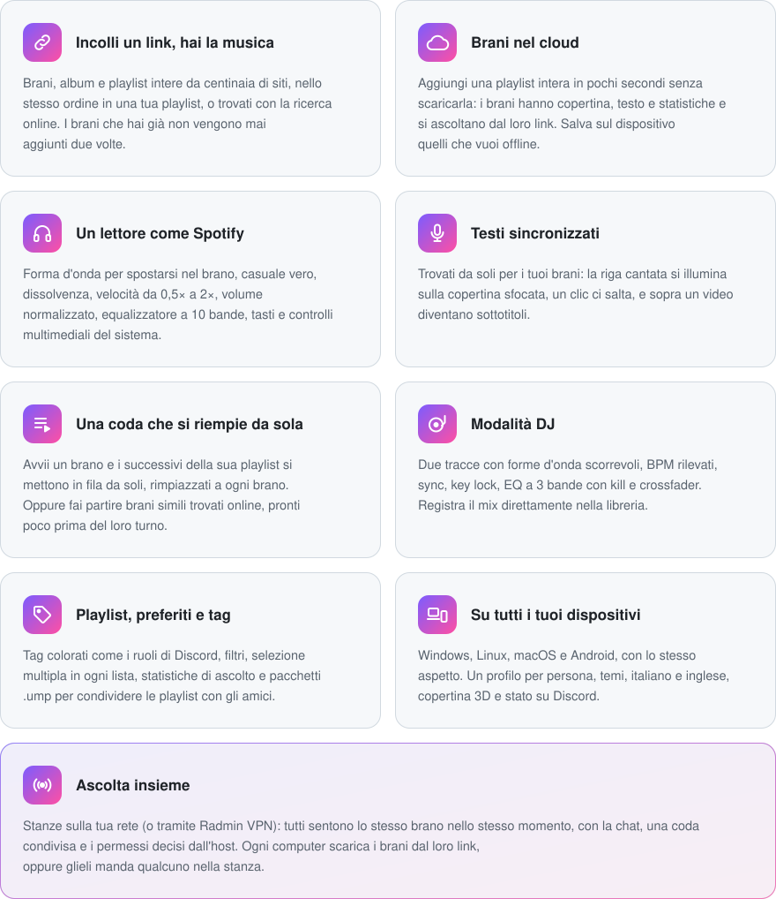

<p align="center">
  
</p>

<h1 align="center">Ultimate MP3 Player</h1>

<p align="center">
  <b>La tua musica, offline e senza pubblicità.</b><br>
  Incolla un link da YouTube Music, Spotify, Apple Music, SoundCloud, YouTube, TikTok, Instagram, Deezer, Bandcamp o
  centinaia di altri siti: i brani finiscono nella tua libreria con copertina e tag, pronti da ascoltare.
</p>

<p align="center">
  <a href="https://github.com/KirboHQ/UltimateMP3Player/releases/latest"></a>
  <a href="https://github.com/KirboHQ/UltimateMP3Player/releases"></a>
  
  
  
  
</p>

<p align="center">
  <a href="https://github.com/KirboHQ/UltimateMP3Player/releases/latest">
    
  </a>
  <a href="https://github.com/KirboHQ/UltimateMP3Player/releases/latest">
    
  </a>
  <a href="https://github.com/KirboHQ/UltimateMP3Player/releases/latest">
    
  </a>
</p>

<p align="center"><a href="README.md">English</a> · <b>Italiano</b></p>

---

## ✨ In breve

<picture>
  <source media="(prefers-color-scheme: dark)" srcset="assets/readme/highlights-it-dark.svg">
  
</picture>

## 🆕 Novità della 3.4.0

- **Linux e macOS**: la stessa app, con lo stesso aspetto e le stesse funzioni, su Linux (x64 e arm64) e macOS (Intel
  e Apple Silicon). Con i controlli multimediali del sistema, l'icona vicino all'orologio, i pacchetti `.ump` e gli
  aggiornamenti automatici.
- **Statistiche**: un ascolto conta quando hai sentito il 75% del brano (a velocità 2× basta metà del tempo), il tempo
  di ascolto conta dal primo secondo, e si aggiornano da soli mentre ascolti. *Seleziona i mai ascoltati* funziona di
  nuovo con qualsiasi ordine e filtro.
- **Controlli multimediali di Windows**: l'app mostra il suo nome e la sua icona invece di *App sconosciuta*
- Un brano consigliato salvato e poi eliminato mentre suona non salta più: finisce dalla memoria
- La ricerca delle impostazioni resta sempre in alto
- Finestre di dialogo (come i termini d'uso): i pulsanti non sfarfallano più sotto il mouse

## 📥 Installazione

**Windows**

1. Scarica **`UltimateMP3Player-Setup-x.y.z.exe`** dall'[ultima release](https://github.com/KirboHQ/UltimateMP3Player/releases/latest).
2. Avvialo: niente diritti di amministratore e nient'altro da installare. Ti chiede la lingua (italiano o inglese,
   si cambia poi dalle impostazioni).
3. Fatto: l'app si aggiorna da sola dalle release.

> [!NOTE]
> Windows SmartScreen può dire che l'app non è riconosciuta, perché non è firmata con un certificato a pagamento:
> clicca **Ulteriori informazioni → Esegui comunque**.

**Linux** (x64 o arm64, qualsiasi distribuzione recente con un desktop)

1. Scarica **`UltimateMP3Player-linux-x64.tar.gz`** (o `-arm64`) dall'[ultima release](https://github.com/KirboHQ/UltimateMP3Player/releases/latest).
2. Estrailo in una tua cartella (non in una di sistema come `/opt`: l'app si aggiorna lì dentro), per esempio:
   ```sh
   mkdir -p ~/.local/opt
   tar -xzf UltimateMP3Player-linux-x64.tar.gz -C ~/.local/opt
   ```
3. Avviala una volta con `~/.local/opt/UltimateMP3Player/UltimateMP3Player`: da lì in poi è nel menu delle
   applicazioni e i pacchetti `.ump` si aprono con lei. Al primo avvio scarica da sola yt-dlp, ffmpeg e gli altri
   motori.

> [!NOTE]
> Su GNOME "puro" l'icona vicino all'orologio richiede l'estensione *AppIndicator* (Ubuntu ce l'ha già); senza,
> chiudere la finestra chiude l'app. Se l'app non parte e nomina ICU, installa il pacchetto `libicu` della tua
> distribuzione.

**macOS** (12 Monterey o successivo)

1. Scarica **`UltimateMP3Player-macos-arm64.zip`** per Apple Silicon (M1 e successivi) o `-x64` per i Mac Intel
   dall'[ultima release](https://github.com/KirboHQ/UltimateMP3Player/releases/latest).
2. Apri lo zip e trascina **Ultimate MP3 Player** in *Applicazioni*.
3. La prima volta macOS dice che non può verificare l'app, perché non è firmata con un certificato Apple a pagamento:
   apri **Impostazioni di Sistema → Privacy e sicurezza** e clicca **Apri comunque** (sulle versioni più vecchie: tasto
   destro sull'app → **Apri**).

> [!NOTE]
> Se macOS dice che l'app "è danneggiata", esegui una volta nel Terminale:
> `xattr -dr com.apple.quarantine "/Applications/Ultimate MP3 Player.app"`

## 🎵 Funzioni

**Download**
- Link da YouTube Music, Spotify, Apple Music, SoundCloud, YouTube, TikTok, Instagram, Deezer, Bandcamp e centinaia
  di altri siti, grazie a yt-dlp e gallery-dl
- MP3 a 320 kbps o formato originale, video fino al 4K, più download insieme
- Riconosce i doppioni (stessa fonte o stesso brano) e gestisce da solo i limiti dei siti: i download si mettono in
  pausa e riprendono più piano
- Cookie del browser (facoltativi) per playlist private e contenuti con limite d'età
- La musica che hai già: trascina file o cartelle nella finestra

**Lettore**
- Forma d'onda, casuale vero, ripeti tutto / ripeti brano, dissolvenza da 1 a 12 secondi
- Volume normalizzato (−14 LUFS) ed equalizzatore a 10 bande con preset e curva di risposta
- Tasti multimediali, controlli multimediali del sistema (Windows, MPRIS su Linux, "In riproduzione" su macOS) e
  icona vicino all'orologio: chiudi la finestra e la musica continua usando pochissima memoria
- I brani con video lo mostrano nella schermata del brano, su uno sfondo sfocato di sé stesso

**Successivi**
- Trascina per riordinare, doppio clic per saltare, lascia sul cestino per togliere
- Coda automatica, *Genera* e *Svuota*, pannello da nascondere di lato
- Brani simili trovati online dopo un brano: si scaricano poco prima del loro turno (quanti in anticipo lo scegli tu),
  e li tieni con il tasto destro
- Ritrovi tutto com'era quando riapri l'app

**Libreria**
- Playlist con copertina personalizzata, Preferiti, ascoltati di recente e la vista *Senza playlist* per fare ordine
- Tag colorati, filtri con più tag (tutti / almeno uno) e `#tag` nella ricerca
- Rinomina un artista su tutti i suoi brani in un colpo; modifica titolo, artista, album, BPM e copertina
- Statistiche di ascolto per profilo: ascolti, tempo e ultimo ascolto di ogni brano, i meno ascoltati per fare pulizia

**DJ**
- Due tracce con forme d'onda scorrevoli e panoramica, CUE, avanti/indietro, range del tempo ±8 / 16 / 50 %, key lock
- Un selettore dei brani per ogni traccia: libreria, playlist, tag, il brano in riproduzione o un file
- BPM rilevati in automatico, TAP su ogni traccia (anche con il tasto T), griglia dei beat e SYNC di tempo e fase
- Mixer con EQ a 3 bande e kill, fader dei canali e crossfader
- Registra il mix e salvalo come MP3 nella libreria, anche in una playlist nuova

**Ascolta insieme**
- Le stanze sulla stessa rete (Wi-Fi o cavo) si trovano da sole; da lontano entrate tutti nella stessa rete di Radmin
  VPN. Una stanza può avere una password e un numero massimo di persone; si può entrare anche con l'indirizzo.
- Tutti sentono lo stesso brano allo stesso punto: comanda l'orologio dell'host, ogni computer lo segue (volume ed
  equalizzatore restano i tuoi)
- Ogni computer si procura il brano in riproduzione e i due dopo: dalla sua libreria, dalla memoria delle stanze, dal
  link del brano, oppure glielo manda qualcuno nella stanza. Un brano parte quando ce l'hanno tutti (o dopo qualche
  secondo per chi ce l'ha); chi arriva dopo entra al punto giusto.
- L'host decide chi può aggiungere, togliere e spostare, saltare, mettere in pausa, andare avanti e indietro; per gli
  altri i tasti sono oscurati. In una stanza i tasti play delle tue liste diventano **+** e il doppio clic mette il
  brano nella stanza.
- Chat, chi ha aggiunto ogni brano, l'avanzamento dei download di tutti, espulsioni, passaggio dell'host. Se l'host
  esce o il suo PC si spegne, la stanza passa a chi ha più permessi (a parità, a chi è entrato per primo).
- I brani ascoltati nelle stanze restano in memoria (10 di base, insieme ai consigliati); quelli che ti piacciono li
  salvi nella libreria o in una playlist
- Il P2P si può spegnere dalle impostazioni: i brani arrivano allora solo dalla tua libreria, dalla memoria o dal loro
  link

> [!TIP]
> La prima volta Windows chiede se l'app può usare la rete: consenti l'accesso. Con Radmin VPN spunta anche *Reti
> pubbliche*, oppure usa **Consenti nel firewall** nell'app. Radmin VPN esiste solo per Windows: con amici su Linux o
> macOS usate ZeroTier o Tailscale, che vanno ovunque (anche su Windows).

**E poi**
- Profili come in Chrome, temi, italiano e inglese, animazioni e scorrimento fluidi
- Stato su Discord con brano, artista, copertina e barra di avanzamento
- Aggiornamenti automatici dalle release di GitHub

## 💬 Aiuto e segnalazioni

Hai trovato un problema o hai un'idea? Apri una [segnalazione](https://github.com/KirboHQ/UltimateMP3Player/issues),
oppure usa **Impostazioni → Aiuto e supporto** nell'app: scrive già lei la versione dell'app e di Windows.

## 🛠️ Compilare

<details>
<summary>Requisiti, comandi e struttura del progetto</summary>
<br>

Serve il .NET 8 SDK, e per l'installer Inno Setup 6. I programmi esterni vanno in `engines\` (vedi
[engines/README.md](engines/README.md)).

| Comando | Risultato |
|---|---|
| `.\build.ps1` | App portatile in `app\` e collegamento sul Desktop |
| `.\build.ps1 -Installer` | `installer\Output\UltimateMP3Player-Setup-<versione>.exe` |
| `.\build.ps1 -Release` | `dist\`: i file da allegare a una release di GitHub: il setup (più `UltimateMP3Player.exe`, facoltativo, per aggiornamenti più leggeri) e i pacchetti per Linux e macOS (`-WindowsOnly` li salta) |
| `.\build-unix.ps1` | Solo i pacchetti per Linux e macOS in `dist\`: `UltimateMP3Player-linux-x64.tar.gz`, `-linux-arm64.tar.gz`, `UltimateMP3Player-macos-x64.zip`, `-macos-arm64.zip` (`-Targets linux-x64,…` per farne solo alcuni) |

Anche i pacchetti per Linux e macOS si fanno da Windows. L'app per macOS è firmata "ad hoc" (senza un certificato
Apple) con [rcodesign](https://github.com/indygreg/apple-platform-rs), scaricato una volta in `tools\bin`: i Mac Apple
Silicon non avviano app senza nessuna firma. La versione in `src\UltimateMP3Player.Avalonia\UltimateMP3Player.Avalonia.csproj`
va tenuta uguale a quella di Windows.

Due impostazioni in `src\UltimateMP3Player\UltimateMP3Player.csproj` (e le stesse due nel progetto Avalonia):

- `<GitHubRepo>proprietario/repo</GitHubRepo>`: dove l'app cerca gli aggiornamenti e apre le segnalazioni. L'ultima
  release deve contenere il setup; se contiene anche `UltimateMP3Player.exe`, gli aggiornamenti scaricano solo quello
  (70 MB invece dell'intero setup).
- `<DiscordAppId>…</DiscordAppId>`: l'applicazione Discord usata per lo stato.

`UMP_DATA=<cartella>` avvia una copia di prova con dati suoi, accanto a quella normale. `src\Mp3Cli` è un programma
da riga di comando per provare il core (download, import, coda, casuale).

| Cartella | Contenuto |
|---|---|
| `src\UltimateMP3Player.Core` | Download (yt-dlp, gallery-dl, ffmpeg), libreria, profili, coda, analisi, traduzioni |
| `src\UltimateMP3Player` | Interfaccia WPF, motore audio (NAudio/WASAPI), motore DJ (SoundTouch), icona, tasti multimediali, aggiornamenti, Discord |
| `src\UltimateMP3Player.Avalonia` | Linux e macOS: la stessa interfaccia disegnata con Avalonia; usa i view model, i motori audio e DJ e gran parte dei servizi di `src\UltimateMP3Player` (uscita audio con SDL3, MPRIS, "In riproduzione" di macOS, aggiornamenti) |
| `installer` | Script di Inno Setup e immagini dell'installazione (`tools\make-images.ps1` le crea da `Logo.xaml`, insieme alle icone per macOS) |

</details>

## 📁 Dove sono i tuoi dati

| Percorso | Contenuto |
|---|---|
| `Musica\Ultimate MP3 Player` | Brani scaricati (MP3/M4A con tag e copertina) e video |
| `%LOCALAPPDATA%\Ultimate MP3 Player` | Libreria, copertine, profili, impostazioni, `errori.log` |
| `%LOCALAPPDATA%\Ultimate MP3 Player\ascolta-insieme` | Brani delle stanze di *Ascolta insieme* e consigliati tenuti per la prossima volta |

Su Linux i dati sono in `~/.local/share/Ultimate MP3 Player` e su macOS in `~/Library/Application Support/Ultimate MP3 Player`
(lì ci sono anche i motori, in `engines`); i brani vanno in `~/Music/Ultimate MP3 Player`.

## 🙏 Software di terze parti

[yt-dlp](https://github.com/yt-dlp/yt-dlp) (Unlicense), [gallery-dl](https://github.com/mikf/gallery-dl) (GPL-2.0),
[FFmpeg](https://ffmpeg.org) (GPL, build da [yt-dlp/FFmpeg-Builds](https://github.com/yt-dlp/FFmpeg-Builds), su Linux
e macOS da [martin-riedl.de](https://ffmpeg.martin-riedl.de)),
[Deno](https://deno.com) (MIT), [NAudio](https://github.com/naudio/NAudio) (MIT),
[SoundTouch.Net](https://github.com/owoudenberg/soundtouch.net) (LGPL-2.1).
Linux e macOS: [Avalonia](https://avaloniaui.net) (MIT), [SDL3](https://www.libsdl.org) (zlib) tramite
[SDL3-CS](https://github.com/ppy/SDL3-CS) (MIT), [Tmds.DBus](https://github.com/tmds/Tmds.DBus) (MIT),
[Fluent System Icons](https://github.com/microsoft/fluentui-system-icons) (MIT) e
[Selawik](https://github.com/microsoft/Selawik) (OFL-1.1), al posto di Segoe UI e delle sue icone.

<sub>Scarica solo contenuti che hai il diritto di scaricare.</sub>
