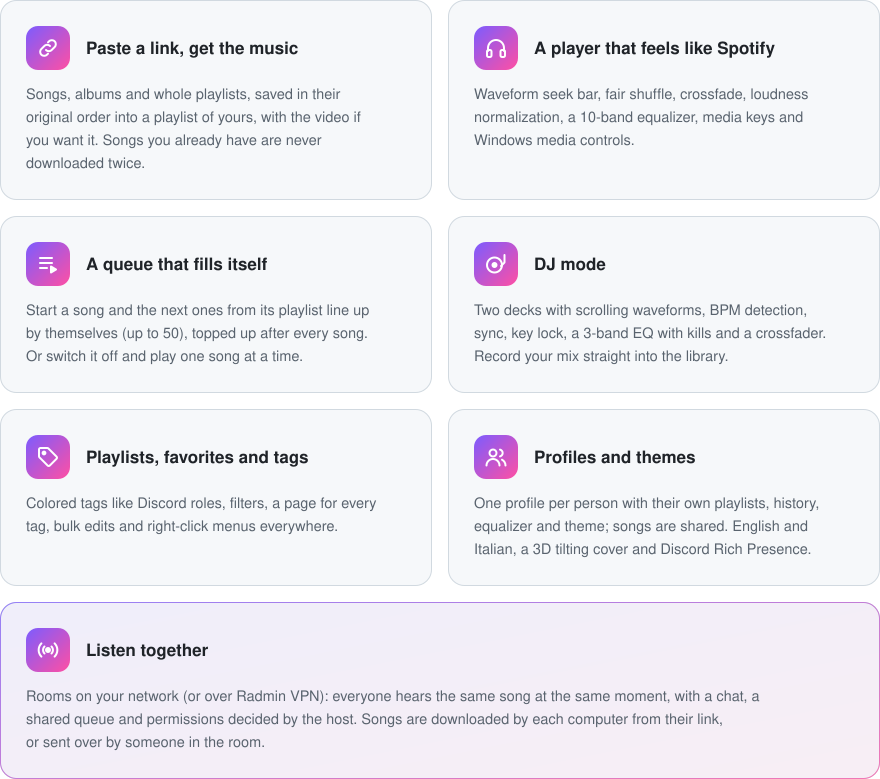

<p align="center">
  
</p>

<h1 align="center">Ultimate MP3 Player</h1>

<p align="center">
  <b>Your music, offline and ad-free.</b><br>
  Paste a link from YouTube Music, Spotify, Apple Music, SoundCloud, YouTube, TikTok, Instagram, Deezer, Bandcamp or
  hundreds of other sites: the songs land in your library with covers and tags, ready to play.
</p>

<p align="center">
  <a href="https://github.com/KirboHQ/UltimateMP3Player/releases/latest"></a>
  <a href="https://github.com/KirboHQ/UltimateMP3Player/releases"></a>
  
  
  
  
  
  <a href="LICENSE"></a>
</p>

<p align="center">
  <a href="https://github.com/KirboHQ/UltimateMP3Player/releases/latest">
    
  </a>
  <a href="https://github.com/KirboHQ/UltimateMP3Player/releases/latest">
    
  </a>
  <a href="https://github.com/KirboHQ/UltimateMP3Player/releases/latest">
    
  </a>
  <a href="https://github.com/KirboHQ/UltimateMP3Player/releases/latest">
    
  </a>
</p>

<p align="center"><b>English</b> · <a href="README.it.md">Italiano</a></p>

---

## ✨ Highlights

<picture>
  <source media="(max-width: 640px) and (prefers-color-scheme: dark)" srcset="assets/readme/highlights-en-dark-mobile.svg">
  <source media="(max-width: 640px)" srcset="assets/readme/highlights-en-light-mobile.svg">
  <source media="(prefers-color-scheme: dark)" srcset="assets/readme/highlights-en-dark.svg">
  
</picture>

## 🆕 What's new in 3.6

- **Songs in the cloud** ☁: a song doesn't need its audio on your device any more. In the cloud it keeps its cover,
  lyrics, statistics and its place in your playlists and Favorites, and plays from its link; the ones you've played
  stay ready for next time. Saved songs play offline as always and a small cloud marks the others. The filter next to
  *Tag* (3.6.2), on your library and on every playlist, shows *All songs*, only the ones *On device* or *Cloud only*;
  *Play* and *Shuffle* play what it shows, handy offline.
- **Add now, save later**: the *Save the audio on your device* switch on the link card decides. On, the usual
  download; off, songs and whole playlists go into your library (and the playlist) in a few seconds, in the cloud. The
  app remembers your choice, also for links-only `.ump` packs. *Save to device* a song, a selection or a playlist, or
  *Save all those in the cloud*, whenever you want them offline.
- **Clear buttons** (3.6.1): **+** adds to a playlist, the **library icon** adds a suggested song (or one heard from a
  link) to your library in the cloud, the **download arrow** saves it on your device. The heart only keeps a song, it
  never downloads it.
- **One *Delete…* for everything**: *Video only*, *Lyrics only*, *From the device* (it stays in your library, in the
  cloud) or *Completely*, with the space it frees, for one song or a hundred. *Free up space…* on playlists.
- **Links that fix themselves**: when a cloud song's link dies (removed, DMCA, made private) the app finds the same
  song on YouTube Music, plays it and keeps the new link. A link that can't be read at all (SoundCloud Go+, removed)
  offers *Retry with YouTube*, and failed downloads *Retry on YouTube*.
- **Find the video…**: a saved song from SoundCloud, Spotify & co. gets its music video from YouTube. You pick it among
  the results: the best match is already chosen, with a warning when the length differs, because the video plays in
  time with the audio. Songs from YouTube take it straight from their link.
- **Select several, everywhere**: in every song list (search and Home too), *Up next*, downloads and playlists, on
  every platform. On Android a long press opens the menu with *Select* first, like the gallery.
- Cloud songs work in DJ mode too (they're downloaded when you load them on a deck), and the temporary storage can now
  keep up to 200 songs.

<details>
<summary>3.5</summary>

**3.5.1 – 3.5.2**
- Android: no more crashes during long downloads, scrolling at the screen's full refresh rate, about a third of the
  processor while on screen, faster start, settings search, *Sign in to sites* inside the app (for private playlists
  and age-restricted content), no audio hiccups with the screen off
- Linux: much smoother (especially in virtual machines and without graphics acceleration), cleaner text, no more crash
  on the online search results

**3.5.0**
- **Android**: the same app on phones and tablets (Android 8 or later), with the same look and features, except DJ
  mode and Listen together. A bottom bar with Home, Search, Library, Downloads and Settings; the song playing just
  above it, opening into its full screen with the cover (tilting under your finger), video, synced lyrics and the queue.
  Turned sideways or on a tablet, the tabs move to a column on the left (like the computer's side bar) and the song's
  page shows the cover next to the title and the buttons. The screen runs at its full refresh rate (90, 120 Hz and more).
- **Share to download**: in YouTube, Spotify, SoundCloud and almost any other app tap *Share → Download with Ultimate
  MP3 Player*: the app opens on the download page with the link already there.
- **Listen without downloading** (every platform): next to *Download*, a link can just be played. Its songs come into
  the temporary storage shortly before their turn, like the suggested ones, and stay out of your library; keep one with
  *Save to library* (on Android also from the notification). In a *Listen together* room the same button is *Add to
  the room*: the songs go into the room's queue without being downloaded to your library.
- **Lock screen and notification**: cover, previous / pause / next and the heart for Favorites (and *Save to library*
  for a song you're only listening to), also from Bluetooth headphones and the car. Music and downloads keep going with
  the screen off.
- **Lighter on the processor and the battery** (every platform): downloads that are waiting or finished no longer keep
  an animation running behind the scenes (a long list could keep a processor core busy), and while the app isn't on
  screen (in the background, minimized, the song's page closed) scrolling titles, spinners, lyrics and video rest.
- Linux and macOS: changing the language in Settings works again.
- Long press is the right click; profiles (handy on a family tablet), statistics, tags, `.ump` packs and automatic
  updates from the GitHub releases are all there.

</details>

<details>
<summary>3.4.0</summary>

- **Linux and macOS**: the same app, with the same look and the same features, on Linux (x64 and arm64) and macOS
  (Intel and Apple Silicon). Media controls of the system, tray icon, `.ump` packs, automatic updates included.
- **Statistics**: a play counts once you've heard 75 % of the song (at 2× speed half the time is enough), time listened
  counts from the first second, and both update live while you listen. *Select the never played* works again from any
  sort and filter.
- **Windows media controls**: the app shows its name and icon instead of *Unknown app*
- A suggested song saved and then deleted while it plays doesn't skip any more: it finishes from the cache
- The Settings search box always stays at the top
- Dialogs (like the terms of use): the buttons no longer flicker under the mouse

</details>

## 📥 Install

**Windows**

1. Download **`UltimateMP3Player-Setup-x.y.z.exe`** from the [latest release](https://github.com/KirboHQ/UltimateMP3Player/releases/latest).
2. Run it: no administrator rights and nothing else to install. It asks for your language (English or Italiano,
   you can change it later in Settings).
3. That's it: the app keeps itself up to date from the releases.

> [!NOTE]
> Windows SmartScreen may say the app is unrecognized because it isn't signed with a paid certificate:
> click **More info → Run anyway**.

**Linux** (x64 or arm64, any recent distribution with a desktop)

1. Download **`UltimateMP3Player-linux-x64.tar.gz`** (or `-arm64`) from the
   [latest release](https://github.com/KirboHQ/UltimateMP3Player/releases/latest).
2. Extract it to a folder of yours (not a system one like `/opt`: the app updates itself there), for example:
   ```sh
   mkdir -p ~/.local/opt
   tar -xzf UltimateMP3Player-linux-x64.tar.gz -C ~/.local/opt
   ```
3. Start it once with `~/.local/opt/UltimateMP3Player/UltimateMP3Player`: from then on it's in the applications menu,
   and `.ump` packs open with it. On the first start it downloads yt-dlp, ffmpeg and the other engines by itself.

> [!NOTE]
> On plain GNOME the tray icon needs the *AppIndicator* extension (Ubuntu has it already); without it, closing the
> window quits the app. If the app doesn't start and mentions ICU, install your distribution's `libicu` package.

**macOS** (12 Monterey or later)

1. Download **`UltimateMP3Player-macos-arm64.zip`** for Apple Silicon (M1 and later) or `-x64` for Intel Macs from the
   [latest release](https://github.com/KirboHQ/UltimateMP3Player/releases/latest).
2. Open the zip and drag **Ultimate MP3 Player** into *Applications*.
3. The first time, macOS says it can't check the app because it isn't signed with a paid Apple certificate: open
   **System Settings → Privacy & Security** and click **Open Anyway** (on older versions: right-click the app →
   **Open**).

> [!NOTE]
> If macOS says the app "is damaged", run once in the Terminal:
> `xattr -dr com.apple.quarantine "/Applications/Ultimate MP3 Player.app"`

**Android** (8 or later; not on the Play Store)

1. On the phone, open the [latest release](https://github.com/KirboHQ/UltimateMP3Player/releases/latest) and download
   **`UltimateMP3Player-android-arm64-v8a.apk`** (almost every phone of the last years; `-armeabi-v7a` is for old
   32-bit phones, `-x86_64` for emulators and Chromebooks).
2. Open the downloaded file. The first time Android asks to allow installing apps from your browser (or file manager):
   allow it, go back and tap **Install**.
3. That's it. On the first start the app prepares its engines (a few seconds), then keeps itself up to date: new
   versions download on Wi-Fi and Android asks before installing them.

> [!NOTE]
> Play Protect may say the app is unknown, because it doesn't come from the Play Store: tap **More details → Install
> anyway**. The music stays in the app's own folder (*Android › data*, visible from a computer); if you uninstall the
> app, Android asks whether to keep it. To move your music to another phone or computer, use a `.ump` pack.

## 🎵 Features

**Downloads**
- Links from YouTube Music, Spotify, Apple Music, SoundCloud, YouTube, TikTok, Instagram, Deezer, Bandcamp and
  hundreds of other sites, powered by yt-dlp and gallery-dl
- **Online search** inside the app: YouTube Music, YouTube, SoundCloud and Deezer next to your own songs; a click opens
  the download
- Save the audio on your device, or just add the songs to your library in the cloud and save them later
- MP3 at 320 kbps or the original format, videos up to 4K, several downloads at a time
- Duplicates are recognized (same source or same song), and site rate limits are handled by themselves: downloads
  pause, then resume more gently
- A link that can't be read, and failed downloads, can be retried on YouTube Music
- Optional browser cookies for private playlists and age-restricted content (on Android you sign in to the sites inside
  the app)
- Music you already have: drag files or folders into the window

**Player**
- Waveform seek bar, fair shuffle, repeat all / repeat one, crossfade from 1 to 12 seconds
- Speed from 0.5× to 2×, with or without changing the pitch
- Loudness normalization (−14 LUFS) and a 10-band equalizer with presets and a live response curve
- **Synced lyrics**, found by themselves: the line being sung lights up over the cover's colors, click a line to jump
  there; over a video they become subtitles
- Media keys, the system's media controls (Windows, MPRIS on Linux, Now Playing on macOS, the lock screen on Android)
  and the tray: close the window and the music keeps playing with very little memory
- Songs with a video show it in the song screen, framed on a blurred copy of itself; *Find the video…* gets one from
  YouTube for the others

**Up next**
- Drag to reorder, double-click to jump, drop on the bin to remove
- Automatic queue, *Generate* and *Clear*, a panel you can hide to the side
- Similar songs found online after a song: downloaded just before their turn (how many ahead is up to you), kept with
  a right-click
- Restored exactly where you left it when you reopen the app

**Library**
- **Songs in the cloud** next to the saved ones: a big library without filling the disk, saved on the device only where
  you want it (*On device only*, *Save all those in the cloud*)
- Playlists with custom covers, Favorites, recently played, and a *Not in a playlist* view to tidy up
- Tags with colors, multi-tag filters (all / any) and `#tag` in the search box
- Select several songs, playlists or downloads in any list and act on all of them at once
- *Delete…* takes away only the video, only the lyrics, the audio from the device or the whole song, and shows the
  space freed
- **`.ump` packs**: a playlist, a tag, several of them or everything in one file, with the audio or as links only
  (small enough for Discord); open it or drop it on the app to import it, without doubling the songs you already have
- Rename an artist on all their songs at once; edit title, artist, album, BPM and cover
- Listening statistics per profile: plays, time listened and last played of every song, the least played to clean up

**DJ**
- Two decks with scrolling waveforms and overviews, CUE, nudge, tempo range ±8 / 16 / 50 %, key lock
- A song browser for each deck: library, playlists, tags, the song playing or a file
- Automatic BPM detection, TAP on each deck (also with the T key), beat grid and SYNC of tempo and phase
- Mixer with 3-band EQ and kills, channel faders and crossfader
- Record the mix and save it as an MP3 in your library, even into a new playlist

**Listen together**
- Rooms found by themselves on the same network (Wi-Fi or cable); from afar, everyone joins the same Radmin VPN
  network. Rooms can have a password and a maximum number of people; you can also join by address.
- Everyone hears the same song at the same point: the host's clock leads, each computer follows it (volume and
  equalizer stay your own)
- Each computer gets the playing song and the next two: from its library, from the room cache, from the song's link,
  or sent by someone in the room. A song starts when everyone has it (or after a few seconds for those who have it);
  late ones join in at the right point.
- The host decides who can add, remove and move, skip, pause, and seek; greyed-out buttons for the others. In a room
  the play buttons of your lists become **+**, and a double click adds the song to the room.
- Chat, who added each song, everyone's download progress, kick, hand over the host. If the host leaves or their PC
  goes off, the room passes to the person with the most permissions (on a tie, who joined first).
- Songs heard in rooms stay in a cache (10 by default, shared with the suggested songs); save the ones you like to
  your library or a playlist
- P2P can be switched off in Settings: songs then come only from your library, the cache or their link

> [!TIP]
> The first time, Windows asks whether the app may use the network: allow it. With Radmin VPN also tick *Public
> networks*, or use **Allow through the firewall** in the app. Radmin VPN exists only for Windows: with friends on
> Linux or macOS use ZeroTier or Tailscale, which work everywhere (also on Windows).

**And also**
- The same app on Windows, Linux, macOS and Android
- Profiles like in Chrome, themes, English and Italian, smooth animations and scrolling
- Discord Rich Presence with song, artist, cover and progress bar
- Automatic updates from the GitHub releases

## 💬 Help & feedback

Found a bug or have an idea? Open an [issue](https://github.com/KirboHQ/UltimateMP3Player/issues), or use
**Settings → Help & support** in the app: it fills in the app and Windows versions for you.

## 🛠️ Build from source

<details>
<summary>Requirements, commands and project layout</summary>
<br>

Requirements: .NET 8 SDK, and for the installer Inno Setup 6. Put the external programs in `engines\` (see
[engines/README.md](engines/README.md)).

| Command | Result |
|---|---|
| `.\build.ps1` | Portable app in `app\` and a Desktop shortcut |
| `.\build.ps1 -Installer` | `installer\Output\UltimateMP3Player-Setup-<version>.exe` |
| `.\build.ps1 -Release` | `dist\`: the files to attach to a GitHub release: the setup (plus `UltimateMP3Player.exe`, optional, for lighter updates), the Linux and macOS packages and the Android APKs (`-WindowsOnly` skips both, `-NoAndroid` only the APKs) |
| `.\build-unix.ps1` | Only the Linux and macOS packages in `dist\`: `UltimateMP3Player-linux-x64.tar.gz`, `-linux-arm64.tar.gz`, `UltimateMP3Player-macos-x64.zip`, `-macos-arm64.zip` (`-Targets linux-x64,…` for some of them) |
| `.\build-android.ps1` | Only the Android APKs in `dist\android\`: `UltimateMP3Player-android-arm64-v8a.apk`, `-armeabi-v7a.apk`, `-x86_64.apk` (`-Out <folder>` elsewhere) |

The Android app needs the .NET 10 SDK with the Android workload (`dotnet workload install android`), the Android SDK
and a JDK (`ANDROID_HOME` / `JAVA_HOME`, or `%LOCALAPPDATA%\Android\Sdk` and `\Android\jdk`). Its engines (Python with
yt-dlp, ffmpeg and QuickJS from [youtubedl-android](https://github.com/JunkFood02/youtubedl-android)) are fetched by
`tools\android-deps.ps1`, pinned by version and SHA-256. The first build creates the signing key in
`%USERPROFILE%\.ultimatemp3player-android`, outside the repository: **keep a copy of that folder** — Android installs an
update only if it's signed with the same key.

The Linux and macOS packages are made on Windows too. The macOS app is signed "ad hoc" (without an Apple certificate)
with [rcodesign](https://github.com/indygreg/apple-platform-rs), downloaded once into `tools\bin`: Apple Silicon Macs
don't run apps without any signature. Keep the version in `src\UltimateMP3Player.Avalonia\UltimateMP3Player.Avalonia.csproj`
the same as the Windows one (and the Android one, in `src\UltimateMP3Player.Android\UltimateMP3Player.Android.csproj`).

Two settings in `src\UltimateMP3Player\UltimateMP3Player.csproj` (and the same two in the Avalonia project):

- `<GitHubRepo>owner/repo</GitHubRepo>`: where the app looks for updates and opens issues. The latest release must
  contain the setup; if it also contains `UltimateMP3Player.exe`, updates download only that (70 MB instead of the
  whole setup).
- `<DiscordAppId>…</DiscordAppId>`: the Discord application used for Rich Presence.

`UMP_DATA=<folder>` runs a test copy with its own data next to the normal one. `src\Mp3Cli` is a command line harness
for the core (downloads, import, queue, shuffle).

| Folder | Content |
|---|---|
| `src\UltimateMP3Player.Core` | Downloads (yt-dlp, gallery-dl, ffmpeg), library, profiles, queue, analysis, translations |
| `src\UltimateMP3Player` | WPF interface, audio engine (NAudio/WASAPI), DJ engine (SoundTouch), tray, media keys, updater, Discord |
| `src\UltimateMP3Player.Avalonia` | Linux and macOS: the same interface drawn with Avalonia; it shares the view models, the audio and DJ engines and most services with `src\UltimateMP3Player` (audio out through SDL3, MPRIS, macOS Now Playing, updater) |
| `src\UltimateMP3Player.Android` | Android: the phone's pages (Avalonia), sharing the view models, the audio engine and the Linux/macOS views' building blocks; the player's service with the notification and lock screen controls (MediaSession), audio out through AudioTrack, the engines inside the app, sharing, updates |
| `installer` | Inno Setup script and wizard images (`tools\make-images.ps1` renders them, and the macOS icons, from `Logo.xaml`) |

</details>

## 📁 Where your data lives

| Path | Content |
|---|---|
| `Music\Ultimate MP3 Player` | Songs saved on the device (MP3/M4A with tags and cover) and videos |
| `%LOCALAPPDATA%\Ultimate MP3 Player` | Library, covers, lyrics, profiles, settings, `errori.log` |
| `%LOCALAPPDATA%\Ultimate MP3 Player\ascolta-insieme` | Temporary storage: cloud songs, suggested songs and songs of *Listen together* rooms you've played, kept for next time |

On Linux the data is in `~/.local/share/Ultimate MP3 Player` and on macOS in `~/Library/Application Support/Ultimate MP3 Player`
(there also the engines, in `engines`); the songs go to `~/Music/Ultimate MP3 Player`. On Android the songs are in the
app's folder `Android/data/com.kirbohq.ultimatemp3player/files/Music` (visible from a computer), the rest inside the
app.

## 🙏 Third-party software

[yt-dlp](https://github.com/yt-dlp/yt-dlp) (Unlicense), [gallery-dl](https://github.com/mikf/gallery-dl) (GPL-2.0),
[FFmpeg](https://ffmpeg.org) (GPL, builds from [yt-dlp/FFmpeg-Builds](https://github.com/yt-dlp/FFmpeg-Builds), on
Linux and macOS from [martin-riedl.de](https://ffmpeg.martin-riedl.de)),
[Deno](https://deno.com) (MIT), [NAudio](https://github.com/naudio/NAudio) (MIT),
[SoundTouch.Net](https://github.com/owoudenberg/soundtouch.net) (LGPL-2.1).
Linux and macOS: [Avalonia](https://avaloniaui.net) (MIT), [SDL3](https://www.libsdl.org) (zlib) through
[SDL3-CS](https://github.com/ppy/SDL3-CS) (MIT), [Tmds.DBus](https://github.com/tmds/Tmds.DBus) (MIT),
[NLayer](https://github.com/naudio/NLayer) (MIT),
[Fluent System Icons](https://github.com/microsoft/fluentui-system-icons) (MIT) and
[Selawik](https://github.com/microsoft/Selawik) (OFL-1.1), in place of Segoe UI and its icons.
Android: the same, plus [youtubedl-android](https://github.com/JunkFood02/youtubedl-android) (GPL-3.0) for Python,
FFmpeg and [QuickJS](https://bellard.org/quickjs/) (MIT) built for Android.

Their licenses, copyright notices and where to find each one's source code are in
[licenses/THIRD-PARTY-NOTICES.txt](licenses/THIRD-PARTY-NOTICES.txt), which also comes with the app (the `licenses`
folder).

## 📄 License

Ultimate MP3 Player is free software, released under the [GNU General Public License v3.0](LICENSE) or any later
version: you can use it, study it, share it and change it, and if you share a changed version it must stay under the
same license, with its source code. This also covers the versions released before the license was added.

<sub>Download only content you have the right to download.</sub>
